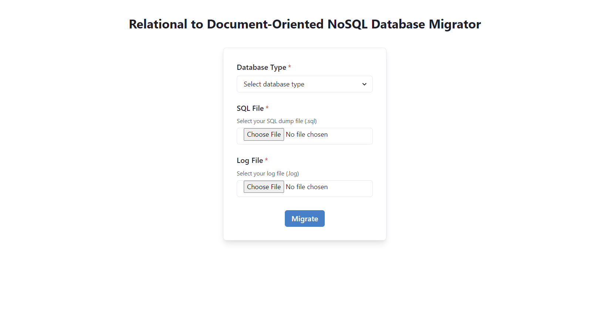
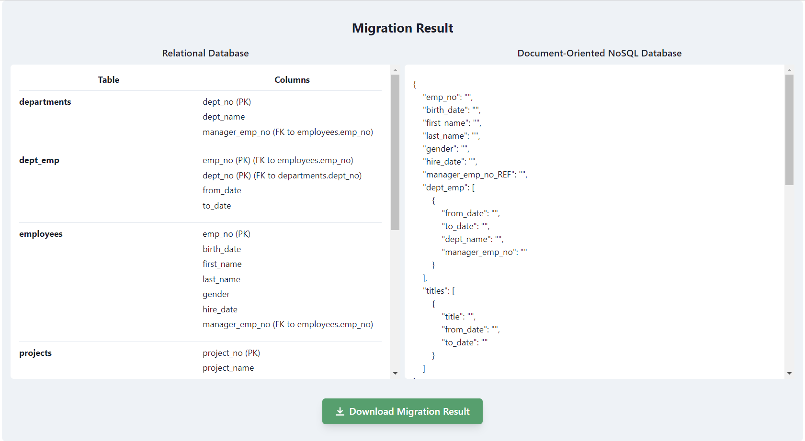

# Relational to Document-Oriented NoSQL Database Migrator
> _IF4092 Tugas Akhir 2 : Pengembangan Tools Migrasi Basis Data Relasional ke Basis Data NoSQL Berorientasi Dokumen dengan Memanfaatkan Log Basis Data Relasional_

## Description
Tools to migrate a Relational Database to a Document-Oriented NoSQL Database based on Relational Database Log

## Requirement
- [Node.js](https://nodejs.org/en/download/)
- [npm](https://docs.npmjs.com/downloading-and-installing-node-js-and-npm)
- [MySQL](https://dev.mysql.com/downloads/)
- [PostgreSQL](https://www.postgresql.org/download/)

## How to Run
1. Clone this repository
```
https://github.com/leoniantoinette/relational-to-doc-oriented-nosql-migrator.git
```

2. Run the front end by executing this command in terminal
```
cd client
npm install
npm run start
```

3. Run the back end by executing this command in terminal
```
cd server
npm install
npm run start
```

## Screenshots
### Input


### Output


## Author
#### Flavia Beatrix Leoni A. S. <br> 13520051
